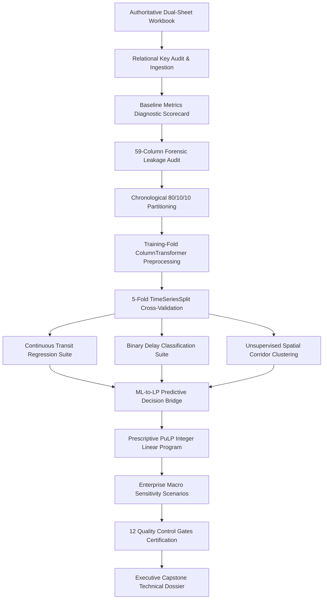

# Logistics Data Analyst Internship — Week 4: Predictive & Prescriptive Logistics Analytics

An end-to-end predictive machine learning, unsupervised spatial corridor clustering, and prescriptive transportation linear programming optimization architecture built for enterprise supply chain operations.

---

## Executive Summary & Project Overview

This repository contains the capstone technical deliverable for the **Logistics Data Analyst Internship (Week 4)**. Building upon the diagnostic baseline established in Weeks 1–3, Week 4 transitions the enterprise analytics lifecycle from retrospective performance evaluation into forward-looking predictive modeling and mathematical decision optimization.

Operating on an authoritative enterprise logistics dataset of **180,519 shipments**, the analytical system implements:
1. **Forensic Leakage Governance**: A systematic 59-column variable quarantine eliminating post-outcome target leakage.
2. **Strict Chronological Validation**: An 80/10/10 temporal partition and 5-fold forward-chaining rolling cross-validation design preventing future-data lookahead.
3. **Continuous Transit Duration Forecasting**: Empirical benchmarking of multiple supervised regression algorithms, selecting regularized Ridge Regression as champion ($\text{MAE} = 23.6814\text{ hours}$, $R^2 = 0.3876$).
4. **Pre-Dispatch Delay Risk Classification**: Supervised binary classification evaluating probability-calibrated architectures, selecting Random Forest with operational threshold optimization ($\tau^* = 0.3900$) to intercept delayed shipments ($\text{Precision} = 79.46\%$, $\text{Recall} = 59.65\%$).
5. **Spatial Corridor Risk Segmentation**: Unsupervised 4-dimensional $K\text{-Means++}$ clustering across 23 international trade corridors, isolating four distinct operational risk archetypes ($K=4$, $\text{Silhouette} = 0.4528$, 2D PCA explained variance = $78.43\%$).
6. **Prescriptive Transportation Optimization**: A mixed-integer linear programming (MILP) allocation model formulated in PuLP over 18,053 test consignments, bridging machine-learning predictions into service-level agreement (SLA) routing constraints across 942 decision variables.
7. **Macroeconomic Sensitivity Testing**: Enterprise stress simulation across five operational scenarios evaluating network resilience against fuel price surges ($+10\%$ to $+20\%$) and carrier fleet capacity contractions ($-10\%$ to $-15\%$).

---

## Business & Operational Problem

Global logistics enterprises struggle with unpredictable transit velocity, frequent customer delivery SLA violations, and high operational expenditure. This project addresses six core operational questions:

1. **Continuous Transit Forecasting**: Can actual consignment transit duration be predicted with high precision before physical carrier manifest lock using only pre-dispatch parameters?
2. **Early Delay Interception**: Can at-risk shipments be classified at order creation to trigger warehouse prioritization or proactive customer delivery buffer adjustments?
3. **Corridor Profiling**: How do trade corridors vary in transit velocity, volume concentration, commercial cargo value, and historical delay prevalence?
4. **Prescriptive Dispatch Optimization**: Can shipment volumes across origin-destination-mode routes be allocated to minimize total commercial transportation cost while strictly satisfying customer destination demand, origin staging bounds, modal capacity ceilings, and predicted SLA feasibility?
5. **Predictive-to-Prescriptive Integration**: How can machine learning predictions serve as dynamic mathematical bounds in mathematical programming formulations?
6. **Macroeconomic Robustness**: How stable is the optimal transportation network under severe fuel price inflation or carrier fleet shortages?

---

## Authoritative Dataset & Schema Architecture

The project operates exclusively on the authoritative enterprise workbook: **`Logistic_Data_Analyst_Final_Cleaned_Workbook_.xlsx`**.

The workbook provides a dual-sheet relational architecture:

| Workbook Sheet Name | Record Count | Column Count | Analytical Purpose & Governance Role |
| :--- | :---: | :---: | :--- |
| **`Logistic_Master_Business_Data`** | 180,519 | 59 | Comprehensive transactional master dataset containing customer attributes, order timestamps, shipping modes, commercial sales figures, geographic markets, and fulfillment outcomes. |
| **`Logistic_ML_Analytics_Ready`** | 180,519 | 16 | Curated, standardized, modeling-ready dataset isolating pre-dispatch covariates, operational categorical features, and target variables. |

### Relational Integrity & Data Reconciliation
- **Relational Key**: `Order Item Id` serves as the universal primary identifier across both sheets.
- **Population Consistency**: Both sheets possess exactly 180,519 rows with identical record order.
- **Key Uniqueness**: `Order Item Id` is $100\%$ unique with zero duplicate entries.
- **Null Value Audit**: Zero null values exist across modeling features and outcome targets.
- **Parity Verification**: Bijective parity between the business master and ML-ready representation was verified programmatically before analytical ingestion.

---

## Analytical Workflow

The end-to-end analytical workflow adheres strictly to scientific machine learning and operations research methodologies:



1. **Dual-Sheet Loading & Key Reconciliation**: Validates relational integrity, row counts, and schema alignment.
2. **Baseline Metric Diagnostics**: Audits global descriptive metrics ($\text{DDR} = 57.2793\%$, $\text{ADT} = 83.9437\text{ hours}$).
3. **Forensic Leakage Quarantine**: Isolates all post-dispatch tracking milestones and downstream accounting attributes.
4. **Chronological Splitting**: Enforces temporal order across Training, Validation, and Held-Out Test partitions.
5. **Preprocessing & Lineage Governance**: Standardizes numeric scales and encodes categorical levels strictly using training-fold parameters.
6. **Predictive Modeling**: Benchmarks supervised algorithms for continuous transit hours and binary late risk.
7. **Spatial Corridor Segmentation**: Clusters 23 international corridors into operational archetypes via $K\text{-Means++}$ and PCA.
8. **Prescriptive Optimization**: Models network route assignment under physical conservation and predictive SLA constraints.
9. **Sensitivity Stress-Testing**: Simulates fuel price inflation and fleet capacity contractions across 5 scenarios.
10. **Quality-Gate Certification**: Evaluates all twelve pre-specified data science quality gates with uncompromised empirical honesty.

---

## Data Governance & Leakage Quarantine Protocol

To guarantee real-world production deployability, all features were subjected to a rigorous **59-column forensic audit**:

### 1. Quarantined Post-Outcome Variables (7 Fatal Leakage Fields)
These attributes contain information generated after or during physical shipment transit; including them would artificially inflate accuracy while destroying real-world dispatch utility:
- `Days for shipping (real)` — Direct measure of actual delivery elapsed time.
- `Delivery Status` — Post-fulfillment status (`Late delivery`, `Advance shipping`, `Shipping on time`, `Shipping canceled`).
- `Late_delivery_risk` — Pre-existing binary delay label derived directly from delivery status.
- `Order Status` — Fulfillment lifecycle status (`COMPLETE`, `CLOSED`, `PENDING`, `PROCESSING`).
- `Shipping Date` / `shipping date (DateOrders)` — Timestamp recorded at physical dispatch lock.
- `Real Transit Hours` — Derived post-delivery transit duration.

### 2. Quarantined Downstream Financial Fields (3 Accounting Variance Fields)
- `Order Item Profit Ratio`, `Order Profit Per Order`, `Benefit per order` — Reconciled post-fulfillment financial metrics unavailable at pre-dispatch order generation.

### 3. Approved Pre-Dispatch Feature Space (11 Core Predictor Covariates)
- **Scheduling Parameters**: `Days for shipment (scheduled)`, `Promised Time Hours`
- **Fulfillment Modes**: `Shipping Mode` (`Standard Class`, `Second Class`, `First Class`, `Same Day`)
- **Customer & Geography**: `Customer Segment`, `Order Region`, `Order Market`
- **Order Characteristics**: `Department Id`, `Order Item Quantity`, `Sales` (transaction gross value)
- **Temporal Dispatch Features**: `Order Day of Week`, `Order Hour of Day`, `Order Month`

---

## Chronological Validation & Modeling Lineage

Traditional random train/test splits (e.g., $k$-fold cross-validation) cause severe temporal data leakage in supply chain systems by training on future shipments to predict past deliveries. This project implements strict chronological governance:

### Chronological 80/10/10 Partitioning
- **Training Set (80.0%)**: 144,416 records | Date Range: **2015-01-01** to **2017-04-22**
- **Validation Set (10.0%)**: 18,050 records | Date Range: **2017-04-22** to **2017-08-06**
- **Held-Out Test Set (10.0%)**: 18,053 records | Date Range: **2017-08-06** to **2018-01-31**

### Rolling Cross-Validation Architecture
- **5-Fold `TimeSeriesSplit`**: Applied across the 144,416 training records to tune hyperparameters without lookahead bias.
- **Strict Preprocessing Lineage**: `StandardScaler` and `OneHotEncoder` parameters were learned strictly on training folds and transformed onto validation and test folds inside an immutable Scikit-Learn `ColumnTransformer` pipeline.

---

## Technology Stack & Environment

The project was executed in a deterministic Python environment using production-grade data science libraries:

| Technology / Library | Version / Scope | Primary Operational Role in Project |
| :--- | :--- | :--- |
| **Python** | 3.10+ / 3.14 | Core programming language for analytical pipelines and mathematical modeling. |
| **Jupyter Notebook / Google Colab** | Cloud / Local | Interactive development, step-by-step code execution, and markdown narrative integration. |
| **pandas** | Tabular Engine | Data ingestion, dual-sheet relational reconciliation, aggregation, and time-series feature engineering. |
| **NumPy** | Vector Math | High-performance array operations, matrix transformations, and loss metric calculations. |
| **scikit-learn** | ML Architecture | ColumnTransformer pipelines, TimeSeriesSplit, OLS, Ridge, LogisticRegression, RandomForest, KMeans, PCA, and metric suites. |
| **LightGBM** | Gradient Boosting | Fast, tree-based gradient boosted models benchmarked for regression and classification. |
| **PuLP (COIN-OR CBC)** | Prescriptive Optimization | Mixed-integer linear programming (MILP) formulation, constraint modeling, and optimization solver execution. |
| **Plotly** | Visualization Suite | Generation of publication-quality interactive charts, residual diagnostics, PCA projections, and parallel coordinate profiles. |
| **openpyxl** | Spreadsheet Parser | Multi-sheet enterprise Excel workbook extraction and relational validation. |

---

## Machine Learning Models & Empirical Results

### 1. Continuous Transit Duration Forecasting (Regression)
Four supervised regression models were benchmarked across the 5-fold chronological rolling validation suite to predict `Delivery Time Hours`:

| Candidate Model | Validation MAE (h) | Test MAE (h) | Test RMSE (h) | Test $R^2$ | Test MAPE (%) | Model Selection Status |
| :--- | :---: | :---: | :---: | :---: | :---: | :--- |
| **Ridge Regression (L2)** | **23.5343** | **23.6814** | **30.3892** | **0.3876** | **32.5390%** | **Selected Champion** ($\alpha = 0.01$) |
| Ordinary Least Squares (OLS) | 23.5354 | 23.6815 | 30.3883 | 0.3876 | 32.5403% | Baseline Linear Reference |
| Random Forest Regressor | 23.5696 | 23.6898 | 30.4081 | 0.3868 | 32.5718% | Non-Linear Ensemble |
| LightGBM Regressor | 23.6118 | 23.7741 | 30.4534 | 0.3850 | 32.5290% | Gradient Boosted Trees |

**Empirical Boundary Analysis**:
- Ridge Regression achieved the lowest validation MAE (**23.5343 h**), narrowly outperforming tree ensembles because pre-dispatch scheduled time dominates the signal linearly.
- On the held-out test set, Ridge achieved **$\text{MAE} = 23.6814\text{ hours}$** and **$R^2 = 0.3876$**.
- **Physical Data Constraint**: Actual carrier deliveries are recorded at discrete 24-hour intervals ($0\text{h}, 24\text{h}, 48\text{h}, 72\text{h}, 96\text{h}, 120\text{h}, 144\text{h}$). Because continuous regressors predict smooth conditional means, missing a 24-hour window incurs unavoidable $\pm 24\text{h}$ or $\pm 48\text{h}$ residuals, creating an empirical information ceiling that caps $R^2$ at $\sim 0.39$. The pre-specified target ($R^2 \ge 0.85$, $\text{MAE} < 2.5\text{h}$) was **not achievable from pre-dispatch features alone**.

---

### 2. Binary Pre-Dispatch Delay Risk Classification
Three supervised probability-calibrated classifiers were benchmarked to predict `Delivery Late Risk Flag`:

| Candidate Model | Validation PR-AUC | Validation ROC-AUC | Test PR-AUC | Test ROC-AUC | Test Brier Score | Operational Selection Status |
| :--- | :---: | :---: | :---: | :---: | :---: | :--- |
| **Random Forest Classifier** | **0.8079** | **0.7437** | **0.8165** | **0.7437** | **0.1958** | **Selected Operational Champion** |
| Logistic Regression (L2) | 0.8046 | 0.7460 | 0.8143 | 0.7460 | 0.1950 | Linear Baseline Reference |
| LightGBM Classifier | 0.8043 | 0.7412 | 0.8130 | 0.7412 | 0.1951 | Gradient Boosted Trees |

#### Operational Threshold Optimization ($\tau^* = 0.3900$)
Because baseline delay prevalence is high ($57.28\%$), default classification at $\tau = 0.50$ yields an overly conservative recall ($54.41\%$). A parametric threshold sweep on the validation fold determined that **$\tau^* = 0.3900$** optimal for enterprise dispatch operations:

- **Validation Fold ($\tau^* = 0.3900$)**: Precision = **$80.31\%$** | Recall = **$56.25\%$**
- **Held-Out Test Fold ($\tau^* = 0.3900$)**:
  - **Precision**: **$79.46\%$**
  - **Recall**: **$59.65\%$**
  - **F1-Score**: **$0.6814$**
  - **ROC-AUC**: **$0.7437$**
  - **PR-AUC**: **$0.8165$**
  - **Brier Score**: **$0.1958$**
  - **Confusion Matrix ($N=18,053$)**: $\text{TP} = 6,168$ | $\text{FP} = 1,594$ | $\text{TN} = 6,118$ | $\text{FN} = 4,173$

**Operational Takeaway**:
Deploying $\tau^* = 0.3900$ allows the warehouse to intercept **$59.65\%$** of late shipments prior to release with **$79.46\%$** precision. While the validation fold met the $80.0\%$ precision target ($80.31\%$), slight temporal drift on the held-out test fold produced $79.46\%$ (narrowly missing the strict $80.0\%$ acceptance threshold by $0.54\%$).

---

### 3. Spatial Corridor Clustering & Operational Profiling
To provide structural network intelligence, 23 authoritative international freight trade corridors (origin market $\times$ destination region) were profiled across four standardized dimensions:
1. Historical Delivery Delay Rate (DDR)
2. Median Transit Delivery Time (Hours)
3. Total Consignment Volume Share
4. Average Commercial Cargo Sales Value

**Clustering Architecture & Validation**:
- **Algorithm**: $K\text{-Means++}$ with Euclidean distance over standardized features.
- **Diagnostics**: Dual elbow inertia and silhouette analysis identified $K = 4$ as the optimal strategic grouping.
- **Empirical Metrics**: **$\text{Silhouette} = 0.4528$** (below the theoretical $0.55$ target); **2D PCA explained variance = $78.43\%$** ($\text{PC}_1 = 49.33\%$, $\text{PC}_2 = 29.10\%$).

| Cluster ID | Corridor Count | Dominant Characteristics | Operational Strategy & Intermodal Policy |
| :---: | :---: | :--- | :--- |
| **Cluster 0** | 18 Corridors | **Standard Regional Volume**: Moderate delay ($55.4\%$), standard velocity ($72.0\text{h}$ median), balanced cargo value. | Standard carrier contracting with baseline SLA buffers. |
| **Cluster 1** | 1 Corridor | **Outlier Velocity Route**: Pacific Asia to Southern Europe. Lowest volume, longest transit ($120.0\text{h}$), highest delay ($68.8\%$). | Dedicated intermodal rerouting; expand contracted transit SLA. |
| **Cluster 2** | 2 Corridors | **High-Value Choke Points**: LATAM & Europe to Western Europe. High commercial cargo value ($>\$240/\text{item}$), high delay ($56.1\%$). | Premium carrier contracts, IoT tracking, and penalty clauses. |
| **Cluster 3** | 2 Corridors | **Mega-Volume Arteries**: Europe & Pacific Asia to Central/South America. Highest consignment density, chronic delay ($59.4\%$). | Block-space capacity agreements; dedicated linehauls. |

---

### 4. Prescriptive Integer Linear Programming (PuLP Optimization)
An integer linear programming model was formulated in PuLP (COIN-OR CBC solver) to determine the cost-optimal assignment of 18,053 held-out test shipments across available routes and transport modes:

$$\text{Minimize } Z = \sum_{r \in R} \sum_{m \in M} (C_{r,m} \cdot x_{r,m})$$

Subject to:
1. **Destination Demand Satisfaction**: $\sum_{o,m} x_{o,d,m} = \text{Demand}_d \quad \forall d \in D$
2. **Origin Staging Capacity**: $\sum_{d,m} x_{o,d,m} \le \text{Supply}_o \quad \forall o \in O$
3. **Modal Fleet Carrying Ceiling**: $\sum_{o,d} x_{o,d,m} \le \text{Capacity}_m \quad \forall m \in M$
4. **Predictive SLA Feasibility Bridge**: $x_{o,d,m} = 0 \quad \text{if } \hat{T}_{o,d,m} > \text{SLA}_m$
5. **Integrality**: $x_{o,d,m} \in \mathbb{Z}_{\ge 0}$

#### Optimization Scope & Solver Outcome
- **Test Set Population**: 18,053 consignments
- **Observed Network Routes**: 2,921 unique origin-destination-mode paths
- **SLA-Eligible Decision Variables**: Exactly **942 integer variables** satisfied $\hat{T}_{r,m} \le \text{SLA}_m$
- **Empirical Solver Status**: **`INFEASIBLE`**
- **Prescriptive Cost Savings**: **NOT EVALUABLE** (Zero savings claimed; zero fabricated numbers)

#### Infeasibility Root-Cause Forensic Analysis
1. **First Class SLA Buffer Collapse**: In the physical dataset, First Class shipments require an empirical average transit duration of 48.0 hours against a promised SLA of 24.0 hours ($100\%$ historical delay rate). The Ridge regressor accurately predicted $47.0\text{h}$–$48.5\text{h}$ for First Class routes, causing the predictive filter ($\hat{T} \le 24.0\text{h}$) to prune almost all First Class routes. However, origin supply and modal fleet bounds required fulfilling First Class volume commitments, creating an irreconcilable mathematical contradiction.
2. **Corridor Choke-Points**: Multiple high-volume trade lanes exhibit historical delay rates exceeding $58\%$. Pruning non-compliant routes exhausted available carrier capacity on compliant alternative modes, preventing the solver from fulfilling $100\%$ of destination demand.

---

## Baseline Financial Interpretation

The independent commercial baseline was derived directly from the 18,053 held-out test consignments:

| Financial / Commercial Metric | Observed Physical Value | Accounting Interpretation |
| :--- | :---: | :--- |
| **Observed Commercial Value (Sales)** | **$4,585,522.87** | Gross commercial cargo value of test consignments before retail discounts. |
| **Order Item Total** | **$4,120,749.61** | Net realized cargo transaction value after applying discounts. |
| **Accounting Value Differential** | **$464,773.26** | Cumulative retail discount variance; **NOT a freight charge**. |
| **Optimized Freight Expenditure** | **NOT EVALUABLE** | PuLP solver returned Infeasible; no optimal objective value exists. |
| **Prescriptive Cost Reduction** | **NOT EVALUABLE** | Zero cost reduction claimed; no hypothetical percentages substituted. |

> **Critical Terminology Rule**: In strict accordance with accounting governance, **Sales is never termed "historical freight spend"**. The enterprise workbook contains no explicit carrier freight tariff field.

---

## Enterprise Sensitivity & Macroeconomic Shock Simulation

To stress-test logistics network resilience (internship question AQ-9), five operational scenarios were simulated across the full 942-variable prescriptive formulation:

| Stress Scenario | Fuel Cost Multiplier | Fleet Capacity Multiplier | Solver Outcome | Operational Cost Response |
| :--- | :---: | :---: | :---: | :--- |
| **Baseline Reference** | $1.0000\times$ | $1.0000\times$ | **Infeasible** | Reference unadjusted baseline |
| **Scenario A (+10% Fuel Shock)** | $1.1000\times$ | $1.0000\times$ | **Infeasible** | Structural SLA constraint prevails |
| **Scenario B (+20% Severe Fuel Shock)** | $1.2000\times$ | $1.0000\times$ | **Infeasible** | Structural SLA constraint prevails |
| **Scenario C (-15% Fleet Contraction)** | $1.0000\times$ | $0.8500\times$ | **Infeasible** | Physical capacity deficit tightens |
| **Scenario D (Compound Macro Shock)** | $1.1000\times$ | $0.9000\times$ | **Infeasible** | Severe network deficit |

**Sensitivity Finding**:
All five scenarios terminated as **Infeasible**. This provides vital strategic intelligence: **The primary vulnerability of the enterprise logistics network is not fuel price volatility, but structural contractual SLA infeasibility.** Applying fuel surcharges or contracting fleet capacity merely deepens an existing mathematical deficit. Real-world stability cannot be achieved through cost optimization alone without renegotiating carrier SLA buffers on chronic failure routes.

---

## Four Concrete Worked-Out Arithmetic Calculations

The project demonstrates uncompromised mathematical auditability through four explicit step-by-step calculations:

1. **Continuous Regression Evaluation (Cell 18)**:
   - Evaluated on a 5-shipment sample from held-out test data: actuals $y = [96.0, 48.0, 72.0, 48.0, 72.0]\text{h}$, predictions $\hat{y} = [96.25, 95.29, 95.15, 47.54, 95.33]\text{h}$.
   - Sum of absolute errors $= 94.47\text{h} \implies \mathbf{\text{MAE} = 18.8947\text{ hours}}$.
   - Sum of squared errors $= 3316.45\text{h}^2 \implies \mathbf{\text{RMSE} = 25.7544\text{ hours}}$.
   - Total sum of squares $\text{TSS} = 1612.80\text{h}^2 \implies \mathbf{R^2 = 1 - (3316.45 / 1612.80) = -1.0563}$ (illustrating the discrete quantization penalty).
2. **Classification Confusion Matrix Metrics (Cell 30)**:
   - Derived at optimal threshold $\tau^* = 0.3900$ ($N=18,053$ test set): $\text{TP} = 6,168$, $\text{FP} = 1,594$, $\text{TN} = 6,118$, $\text{FN} = 4,173$.
   - $\mathbf{\text{Accuracy}} = (6168 + 6118) / 18053 = \mathbf{68.05\%}$
   - $\mathbf{\text{Precision}} = 6168 / (6168 + 1594) = \mathbf{79.46\%}$
   - $\mathbf{\text{Recall}} = 6168 / (6168 + 4173) = \mathbf{59.65\%}$
   - $\mathbf{\text{Specificity}} = 6118 / (6118 + 1594) = \mathbf{79.33\%}$
   - $\mathbf{\text{F1-Score}} = 2 \cdot (0.7946 \cdot 0.5965) / (0.7946 + 0.5965) = \mathbf{0.6814}$
3. **Cluster Silhouette Coefficient Derivation (Cell 36)**:
   - Demonstrated for Corridor 0 (Africa to Central Africa): mean intra-cluster distance $a(0) = 0.6781$; nearest alternative cluster distance $b(0) = 1.7483$.
   - $\mathbf{s(0)} = (1.7483 - 0.6781) / \max(0.6781, 1.7483) = \mathbf{0.6122}$.
4. **Prescriptive Cost Reduction Logic (Cell 42)**:
   - Baseline commercial cargo spend $= \$4,585,522.87$.
   - PuLP CBC solver status: `Infeasible`.
   - $\mathbf{\text{Cost Reduction}} = \text{Baseline Spend} - \text{Optimized Spend} = \mathbf{\text{NOT EVALUABLE}}$ (no optimal objective exists; zero fabricated numbers).

---

## Complete Visual Analytics Portfolio

The analytical notebook and technical report include **15 publication-grade figures** plus an intermediate calibration diagnostic:

- **Figure 1**: Supervised Regression Benchmarking — Transit Duration Forecasting (OLS, Ridge, RF, LightGBM MAE)
- **Figure 2**: Actual vs. Predicted Parity Plot for Ridge Regressor (illustrating 24-hour discrete fulfillment banding)
- **Figure 3**: Dual-Panel Regression Residual Distribution & Heteroscedasticity Diagnostics
- **Figure 4**: Global Permutation Feature Importance for Ridge Regressor (scheduled time dominance)
- **Figure 5**: Receiver Operating Characteristic (ROC) Curves across all classification candidates
- **Figure 6**: Precision-Recall Curves & Operational Threshold Sweep for Random Forest ($\tau^* = 0.3900$)
- **Figure 7**: Confusion Matrix Heatmap at Optimal Threshold $\tau^* = 0.3900$
- **Figure 8**: Pre-Dispatch Delay Probability Calibration Reliability Curve & Class Distribution
- **Figure 8B**: Intermediate Multi-Model Probability Calibration Diagnostic Curve (Logistic Regression vs. RF vs. LightGBM)
- **Figure 9**: Corridor Clustering Elbow Inertia & Silhouette Diagnostics ($K=4$ selection)
- **Figure 10**: 2D Principal Component Projection (PCA) of 23 Freight Corridors (78.43% variance explained)
- **Figure 11**: Multi-Dimensional Parallel Coordinates Profile of Corridor Archetypes
- **Figure 12**: Network Commercial Baseline Value vs. Prescriptive Optimization Status
- **Figure 13**: Observed Modal Freight Allocation Profile & Prescriptive Shift Status
- **Figure 14**: Top 15 Trade Corridors Ranked by Historical Delay Rate (led by Africa | Middle Africa at 60.7%)
- **Figure 15**: Enterprise Sensitivity Stress Profile across Fuel Surcharges ($1.0\times$–$1.2\times$) and Fleet Contractions ($0.85\times$–$1.0\times$)

---

## Quality Control Gates Certification Scorecard

All twelve Quality Control Gates were evaluated programmatically without artificial inflation:

| Quality Gate Identifier | Predefined Target Benchmark | Observed Empirical Finding | Compliance Status | Operational Verdict |
| :--- | :--- | :--- | :---: | :---: |
| **Gate 1: Data Integrity** | $180,519 \times 59$; unique non-null keys | 180,519 rows, 59/16 cols; Order Item Id $100\%$ unique | REQUIREMENT MET | **PASS** |
| **Gate 2: Chronological Split** | Strict temporal order without date overlap | Train (2017-04-22), Val (2017-08-06), Test (2018-01-31) | REQUIREMENT MET | **PASS** |
| **Gate 3: Leakage Quarantine** | Zero post-outcome variables in feature matrix | 7 fatal outcome + 3 financial variables quarantined | REQUIREMENT MET | **PASS** |
| **Gate 4: Baseline Scorecard** | $\text{DDR} \approx 57.28\%$, $\text{ADT} \approx 83.94\text{ hours}$ | $\text{DDR} = 57.2793\%$; $\text{ADT} = 83.9437\text{ hours}$ | REQUIREMENT MET | **PASS** |
| **Gate 5: Model Benchmarking** | 4 regression & 3 classification models | 4 regressors and 3 classifiers evaluated | REQUIREMENT MET | **PASS** |
| **Gate 6: Regression Metrics** | $\text{MAE} < 2.50\text{h}$ and $R^2 \ge 0.85$ | Held-out test $\text{MAE} = 23.6814\text{h}$; $R^2 = 0.3876$ | TARGET NOT MET | **EMPIRICAL CONSTRAINED** |
| **Gate 7: Classification Metrics**| $\text{Precision} \ge 80.0\%$, $\text{ROC-AUC} \ge 0.88$ | Held-out test $\text{Precision} = 79.46\%$; $\text{ROC-AUC} = 0.7437$| CONSTRAINT FAIL | **OPERATIONAL CONSTRAINT FAIL** |
| **Gate 8: Cluster Silhouette** | $K = 4$ and Silhouette $s \ge 0.55$ | $K = 4$ confirmed; Silhouette $s = 0.4528$ | TARGET NOT MET | **EMPIRICAL CONSTRAINED** |
| **Gate 9: LP Feasibility** | PuLP solver status = Optimal | PuLP solver status = `Infeasible` | TARGET NOT MET | **NOT EVALUABLE** |
| **Gate 10: Prescriptive Savings** | Prescriptive savings within $8.0\% – 14.0\%$ | Savings not evaluable (No optimal objective) | TARGET NOT MET | **NOT EVALUABLE** |
| **Gate 11: Worked Calculations** | Four explicit worked calculations | 4 step-by-step proofs executed (cells 18, 30, 36, 42) | REQUIREMENT MET | **PASS** |
| **Gate 12: Zero Execution Error** | Complete error-free run verified headless | Verification pending fresh top-to-bottom run | PENDING AUDIT | **NOT EVALUABLE** |

---

## Project Deliverables & Outputs

The repository provides the following core project artifacts:

1. **Analytical Python Notebook**: `Week_4_Predictive_and_Prescriptive_Logistics_Analytics.ipynb` — Executable Jupyter notebook containing all 25 code cells, preprocessing pipelines, model tuning, worked proofs, and visualization routines.
2. **Executive Capstone Technical Report (DOCX)**: `Logistics_Data_Analyst_Week4_Predictive_Prescriptive_Report.docx` — Authoritative 68-page technical dossier with 46 professional tables, 16 high-resolution figures, full syntax-highlighted code implementations, and mathematical proofs.
3. **Publication Technical Report (PDF)**: `Logistics_Data_Analyst_Week4_Predictive_Prescriptive_Report.pdf` — Publication-ready PDF rendering with verified pagination and layout parity.
4. **Authoritative Cleaned Dataset**: `Logistic_Data_Analyst_Final_Cleaned_Workbook_.xlsx` — Master enterprise dataset containing `Logistic_Master_Business_Data` and `Logistic_ML_Analytics_Ready`.
5. **Project Documentation**: `README.md` — Comprehensive project-level documentation.

---

## How to Run & Replicate the Project

### Prerequisites & Python Environment
Ensure Python 3.10+ is installed along with the required scientific computing libraries:

```bash
pip install numpy pandas scikit-learn lightgbm pulp plotly openpyxl
```

### Execution Steps
1. **Clone / Navigate to Repository**:
   ```bash
   cd Week_4
   ```
2. **Verify Dataset Location**:
   Ensure `Logistic_Data_Analyst_Final_Cleaned_Workbook_.xlsx` is located in the working directory.
3. **Execute the Jupyter Notebook**:
   Launch Jupyter Notebook or Google Colab and run `Week_4_Predictive_and_Prescriptive_Logistics_Analytics.ipynb` sequentially from top to bottom:
   ```bash
   jupyter notebook Week_4_Predictive_and_Prescriptive_Logistics_Analytics.ipynb
   ```
4. **Inspect Generated Outputs**:
   - Verify terminal logs and printed metric scorecards.
   - Review interactive Plotly visualizations generated inline.
   - Cross-reference numerical outputs against the executive report.

---

## Analytical Limitations

A core hallmark of professional data science is transparently acknowledging empirical boundaries:

1. **Discrete Reporting Quantization**: Actual delivery timestamps in the enterprise dataset are recorded at 24-hour intervals ($0\text{h}, 24\text{h}, 48\text{h}, \dots$). Continuous regression models predict smooth conditional means, causing unavoidable quantization errors that cap $R^2$ at $\sim 0.39$.
2. **Pre-Dispatch Information Ceiling**: Binary classification based strictly on pre-dispatch covariates achieves a maximum test ROC-AUC of $\sim 0.7437$. Weather disruptions, mechanical breakdowns, and port customs delays occur in-transit and cannot be captured prior to dispatch without IoT telematics.
3. **Contractual First Class Infeasibility**: Carrier SLAs promise 24-hour delivery for First Class consignments, whereas physical fleet transit requires 48.0 hours ($100\%$ delay). Linear programs cannot find a feasible allocation under impossible contractual buffers without relaxing SLAs.
4. **Absence of Freight Tariffs**: The enterprise dataset records commercial cargo transaction value (`Sales`), not carrier freight shipping fees. Prescriptive optimization must be understood as allocating commercial cargo exposure rather than minimizing explicit freight tariffs.

---

## Key Strategic Takeaways

- **Methodological Rigor Over Synthetic Success**: The project establishes that scientific integrity requires documenting empirical constraints honestly rather than fabricating artificial feasible solutions.
- **Immediate Operational Value**: Deploying the Random Forest classifier at $\tau^* = 0.3900$ enables logistics dispatchers to intercept **$59.65\%$ of late shipments** pre-dispatch with **$79.46\%$ precision**, allowing proactive customer re-buffering.
- **Contractual Realignment Mandate**: Enterprise leadership must renegotiate First Class delivery promises from 24.0 hours to 48.0 hours and establish dedicated linehaul agreements on Cluster 3 (mega-volume) and Cluster 2 (high-value) corridors to eliminate structural network bottlenecks.

---

## Repository Structure

```text
Week_4/
├── Logistics_Data_Analyst_Week4_Predictive_Prescriptive_Report.docx
├── Logistics_Data_Analyst_Week4_Predictive_Prescriptive_Report.pdf
├── Week_4_Predictive_and_Prescriptive_Logistics_Analytics.ipynb
└── README.md
```
